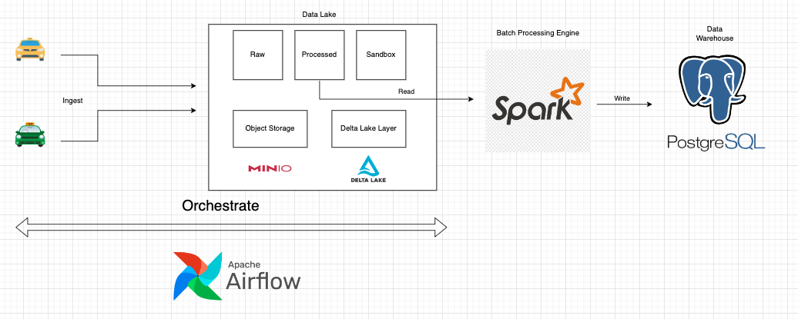

# 🚕 NYC_TAXI Data Pipeline 🚕
This project demonstrates a complete data pipeline built with **Apache Airflow**, **PySpark**, and **PostgreSQL**. The pipeline performs the following steps:

1. **Data Ingestion**: Moves Parquet files from the local system to an object storage service (**MinIO**).  
2. **Data Transformation**: Processes and transforms the data using **PySpark**, converting it into a structured format.  
3. **Data Storage**: Saves the transformed data to a **Delta Lake** for reliability and incremental updates.  
4. **Data Warehouse Integration**: Loads the processed data into a **PostgreSQL** Data Warehouse for analytics and reporting.  

This project showcases scalable, modern data engineering practices and integrates open-source tools to handle large-scale data efficiently.

# 📁 Repository Structure

```shell
.
    ├── airflow/                                    /* airflow folder including dags,.. /*
    ├── batch_processing/
    │   └── datalake_to_dw.py                           /* ETL data from datalake to staging area /*
    ├── configs/                                    /* contain config files /*
    │   ├── spark.yaml
    │   └── datalake.yaml
    ├── data/                                       /* contain dataset /*
    │   ├── 2020/
    │   ├── 2021/
    │   ├── 2022/
    │       ├── green_tripdata_2022-01.parquet
    │       ├── green_tripdata_2022-02.parquet
    │       ├── green_tripdata_2022-03.parquet
    │       ├── ...
    │       ├── yellow_tripdata_2022-01.parquet
    │       ├── yellow_tripdata_2022-02.parquet
    │       ├── yellow_tripdata_2022-03.parquet
    │       └── ...
    │   ├── 2023/
    │   └── 2024/                                  /* run create connector */
    ├── imgs/
    ├── jars/                                       /* JAR files for Spark version 3.5.1 */
    ├── scripts/
    │   ├── data/
    │       └── taxi_lookup.csv                             /* CSV file to look up latitude and longitude */
    │   ├── extract_load.py                             /* upload data from local to 'raw' bucket (MinIO) */
    │   ├── transform_data.py                           /* transform data to 'processed' bucket (MinIO) */
    │   └── convert_to_delta.py                         /* convert data parquet file from 'processed' to 'delta' bucket (MinIO) */
    ├── utils/                                     /* functions /*
    │    ├── create_schema.py
    │    ├── create_table.py
    │    ├── postgresql_client.py                       /* PostgreSQL Client: create connect, execute query, get columns in bucket /*
    │    ├── helper.py
    │    ├── minio_utils.py                             /* Minio Client: create connect, create bucket, list parquet files in bucket /*
    ├── .env
    ├── .gitignore
    ├── airflow-docker-compose.yaml
    ├── docker-compose.yaml
    ├── Makefile
    ├── README.md
    ├── requirements.txt
    └── stream-docker-compose.yaml
```

# 🌟 System Architecture

<p align="center">


<p align="center">
    System Architecture
</p>

# 🚀 Getting Started

1.  **Clone the repository**:

    ```bash
    git clone https://github.com/benminh121/NYC-ETL
    ```

2.  **Start all infrastructures**:

    ```bash
    make run_all
    ```

    This command will download the necessary Docker images, create containers, and start the services in detached mode.

3.  **Setup environment**:

    ```bash
    conda create -n nyc python==3.12
    y
    conda activate nyc
    pip install -r requirements.txt
    ```

    Activate your conda environment and install required packages

4.  **Access the Services**:

    - Postgres is accessible on the default port `5432`.
    - MinIO is accessible at `http://localhost:9001`.
    - Airflow is accessible at `http://localhost:8080`.

5.  **Download Dataset**:
    You can download and use this dataset in here: https://www.nyc.gov/site/tlc/about/tlc-trip-record-data.page

6.  **Download JAR files for Spark**:

    ```bash
    mkdir jars
    cd jars
    curl -O https://repo1.maven.org/maven2/com/amazonaws/aws-java-sdk-bundle/1.12.262/aws-java-sdk-bundle-1.12.262.jar
    curl -O https://repo1.maven.org/maven2/org/apache/hadoop/hadoop-aws/3.3.4/hadoop-aws-3.3.4.jar
    curl -O https://repo1.maven.org/maven2/org/postgresql/postgresql/42.4.3/postgresql-42.4.3.jar
    curl -O https://repo1.maven.org/maven2/org/apache/spark/spark-sql-kafka-0-10_2.12/3.2.1/spark-sql-kafka-0-10_2.12-3.2.1.jar
    ```